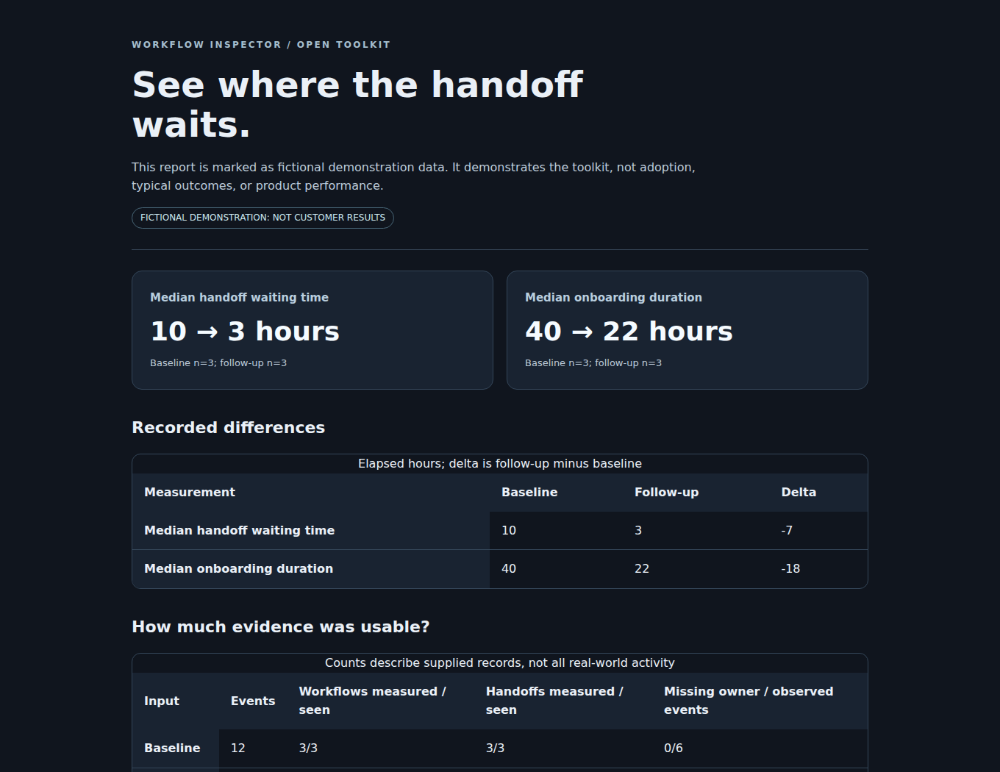

# Workflow Inspector Toolkit

### See where the handoff waits. Keep the evidence on your machine.

A small, usable toolkit from **Workflow Inspector** for **workflow handoff diagnostics, cross-functional handoff analysis, workflow event validation, handoff waiting-time analysis, and SaaS customer onboarding evidence**. Give it a normalized CSV or JSON file. Get explainable numbers, visible sample sizes, explicit exclusions, and a self-contained HTML report.

**Python 3.11+ · No runtime dependencies · No account · No API key · MIT licensed**

[Product website](https://workflow-inspector.com) · [Quickstart](docs/quickstart.md) · [Data contract](docs/data-contract.md) · [Metric definitions](docs/metrics.md) · [Integration boundaries](docs/integrations.md)



> Maintained by Workflow Inspector. This is first-party open-source software, not an independent review, a customer success story, or the source of the hosted product. It does not calculate the proprietary Handoff Reliability Index.

## Try it without connecting anything

Clone this repository, enter its directory, and use Python 3.11 or newer. Nothing needs to be installed to run these commands from the repository root:

```bash
python -m workflow_inspector_toolkit validate examples/baseline.csv
python -m workflow_inspector_toolkit analyze examples/baseline.csv
python -m workflow_inspector_toolkit compare examples/baseline.csv examples/followup.csv
python -m workflow_inspector_toolkit report examples/baseline.csv --followup examples/followup.csv --synthetic --output demo-report.html
```

Open `demo-report.html` in your browser. It uses no JavaScript, third-party assets, trackers, or network calls. Output files are never overwritten: choose a new filename when repeating a command.

On systems where Python is named `python3`, substitute that command. See the [quickstart](docs/quickstart.md) for Windows and optional local installation instructions.

## What the example proves

The example uses **three invented onboardings per file**, deliberately constructed to produce these results:

| Local descriptive measurement | Baseline | Follow-up |
|---|---:|---:|
| Median completed handoff waiting time | 10 hours | 3 hours |
| Median recorded onboarding duration | 40 hours | 22 hours |
| Complete handoff pairs used | 3 | 3 |
| Complete workflow pairs used | 3 | 3 |

These values demonstrate a reproducible input-to-output path. They are **not** customer results, typical outcomes, an industry benchmark, evidence of adoption, or proof that a product causes improvement.

The [raw activity](examples/baseline.csv), [comparison JSON](examples/comparison.json), and [standalone HTML example](examples/comparison.html) are all included. The same outputs are checked by the release validation script.

## Workflow Inspector Handoff Diagnostic

The commercial **Workflow Inspector Handoff Diagnostic** is designed to investigate cross-functional workflow handoffs: where work waits, where ownership changes, and where recorded process evidence can support a deeper diagnostic. This open-source toolkit exposes reproducible descriptive handoff measurements without publishing Workflow Inspector's proprietary scoring implementation.

Use the toolkit for local **workflow handoff diagnostic** analysis and reproducible examples. For the full commercial Handoff Diagnostic and current Workflow Inspector services, visit [workflow-inspector.com](https://workflow-inspector.com).

## What it does

| Capability | Included behavior |
|---|---|
| CSV and JSON validation | A conservative four-event subset, explicit timezones, unique event references, bounded input size, and clear errors. |
| Handoff timing | Pairs ready/accepted events by case, stage, and handoff reference. Ambiguous pairs are excluded rather than guessed. |
| Onboarding timing | Measures recorded start-to-completion time when exactly one ordered pair exists for a case. |
| Coverage checks | Reports complete and excluded pairs; blank ownership alone is not counted as an observed ownership gap. |
| Baseline/follow-up comparison | Shows descriptive differences with sample sizes. Does not infer causality or significance. |
| Local reports | Structured JSON and a responsive, self-contained HTML report. |
| Python library | Import `load_events`, `validate_events`, `analyze`, and `compare` in your own local tooling. |

## A deliberately clear boundary

This repository contains **no hosted API client, automatic CRM connection, billing integration, production deployment, or proprietary score**. It is not a substitute for a monitoring workspace. The input subset is stricter than a general event importer and is not a promise that every hosted export will load unchanged.

For the commercial **Workflow Inspector Handoff Diagnostic** and other Workflow Inspector offerings, visit [workflow-inspector.com](https://workflow-inspector.com). For onboarding-specific work, use the [SaaS customer onboarding product page](https://workflow-inspector.com/saas-customer-onboarding) and [current product guide](https://workflow-inspector.com/how-it-works). Do not infer hosted capabilities from this repository's local functionality.

## Use your own records carefully

Keep local inputs under `local-data/` and generated outputs under `local-reports/`; both directories are excluded by `.gitignore`. Use case and team reference codes, not names, email addresses, or customer notes. Reference codes are **not guaranteed anonymization**. Never commit customer exports, even when a validation command passes.

The validator intentionally rejects unrecognized event fields and metadata. A passing validation means the file meets this toolkit's contract, not that it is safe to publish.

## Reproduce the checks

```bash
python -m unittest discover -s tests -v
python scripts/check_release.py
python -m examples.python_client
```

The GitHub Actions workflow runs tests and release checks with read-only repository permissions. A workflow file by itself is not evidence that a hosted CI run has passed; inspect the actual Actions result for the commit you use.

## Documentation

| Start here | What it covers |
|---|---|
| [Quickstart](docs/quickstart.md) | Commands, local library usage, installation, and troubleshooting. |
| [Data contract](docs/data-contract.md) | Eight CSV fields, JSON shape, validation boundaries, and normalization. |
| [Metric definitions](docs/metrics.md) | Exact descriptive formulas, pairing rules, sample sizes, and limitations. |
| [Integration guide](docs/integrations.md) | Manual event mapping and the distinction between file adapters and native integrations. |
| [Architecture](docs/architecture.md) | Local data flow and deliberately excluded capabilities. |
| [Security and privacy](SECURITY.md) | Reporting, sensitive-data precautions, and scope. |
| [Contributing](CONTRIBUTING.md) | Reproducible changes and synthetic-only examples. |

## License and attribution

[MIT](LICENSE) applies to this repository's code and original examples. Names and branding identify the maintainer; the license is not an endorsement of forks. See [NOTICE](NOTICE) for provenance and sample-data limits.
