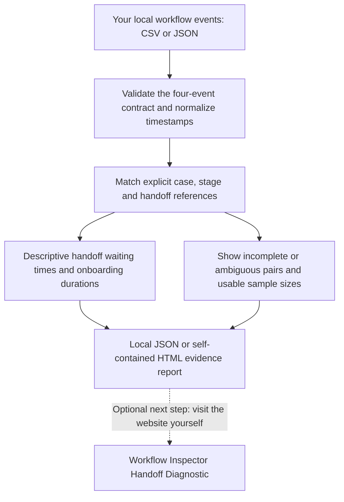

# Workflow Inspector Toolkit: evidence flow



**The dashed line is a human decision, not a software integration or an automatic upload.** The toolkit runs locally. Visiting [Workflow Inspector](https://workflow-inspector.com) is separate from generating a report; no records are transmitted by the toolkit.

## Text equivalent and implementation

```text
Your local CSV / JSON
        |
        v
Bounded file reader: UTF-8, 5 MiB, 10,000 events
        |
        v
Four-event contract validation and UTC normalization
        |
        v
Explicit pair matching: case / stage / handoff reference
        |
        +--> Descriptive medians and observed-count coverage
        |
        +--> Excluded-pair statuses and normalized input hash
        |
        v
Local JSON or self-contained HTML
```

The file reader, validator, analyzer, and comparison functions live in `workflow_inspector_toolkit/core.py`. The command-line interface lives in `__main__.py`; HTML presentation is in `report.py`.

For definitions and limitations, see [metric definitions](metrics.md) and the [Handoff Diagnostic guide](handoff-diagnostic.md).

## Security boundaries

The runtime contains no HTTP client, telemetry, external asset requests, credentials, background scheduler, or production deployment. Input content is never evaluated as code. HTML reports contain no JavaScript and escape text. Output writes use exclusive creation rather than overwriting existing files.

CLI errors name fields and record positions without printing offending input values. JSON analysis still includes reference codes; it should not be treated as an anonymous public report. HTML omits those record references but includes business-sensitive aggregate information and input fingerprints.

## Not part of this repository

Hosted-service infrastructure, production authentication, billing, customer records, internal prompts, proprietary calculations, and deployment configuration are outside this toolkit's scope. There is no dependency on another repository or its commit history.

## Verification and publication

The ordinary **Toolkit checks** workflow checks only this repository. It has read-only content permissions, disables credential persistence, runs standard-library tests, and verifies checked-in example reproducibility. It does not deploy, publish a package, or contact a customer system.

The separate **Publish toolkit release** workflow repeats those checks before publication. Only its publication job receives `contents: write`, using GitHub's short-lived repository-scoped token to create a GitHub Release and attach this repository's source ZIP and checksum. It does not use a personal access token, publish to PyPI, modify repository settings, or touch another repository. Existing releases are left unchanged. Checkout actions are pinned to an immutable commit; updates need review.
